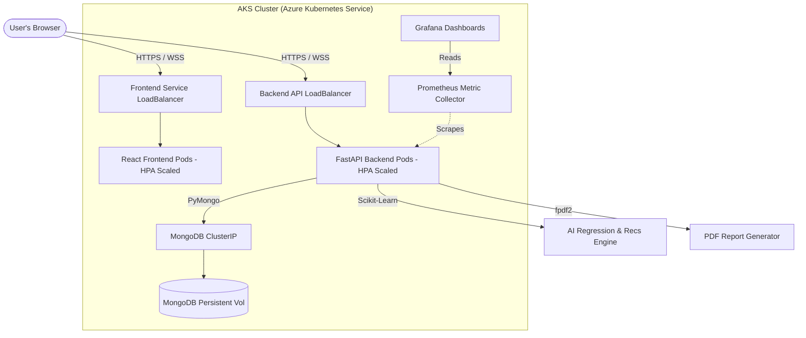
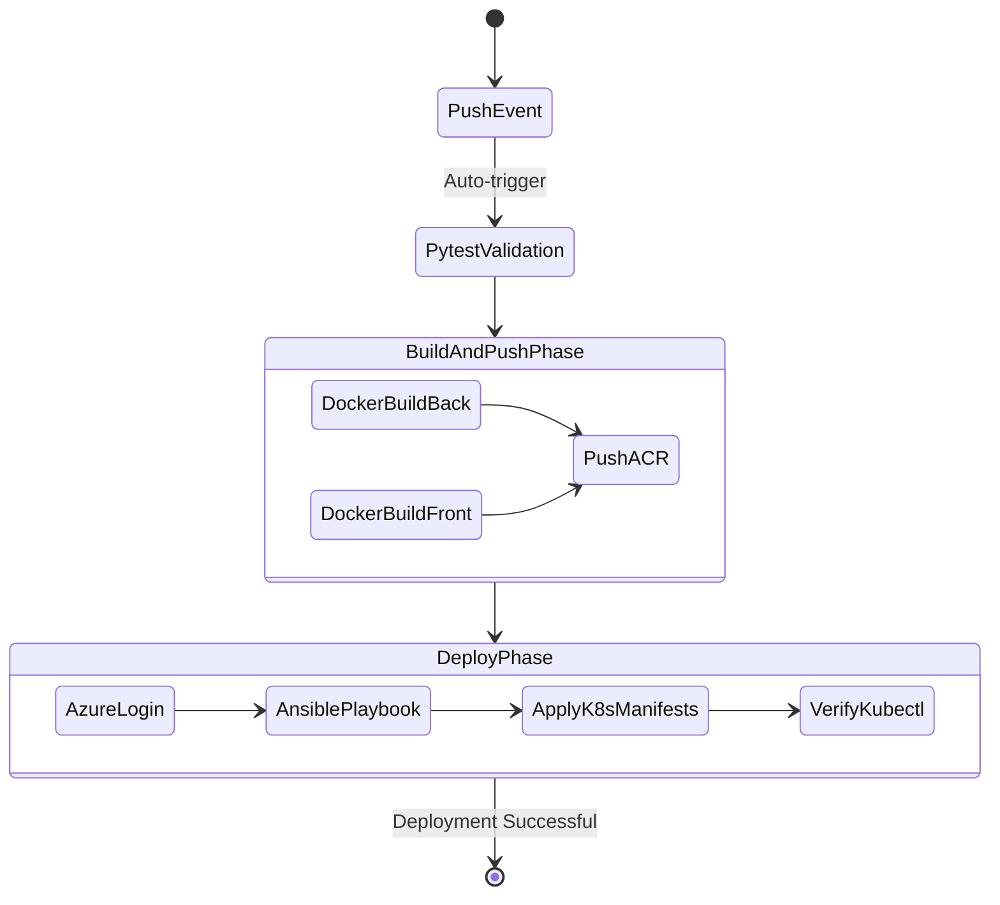

# AI-Enhanced Real-Time Carbon Intelligence Platform
**Complete DevOps Lifecycle & Industry-Grade Cloud Architecture**

This project delivers a highly scalable web application designed to track, predict, and reduce carbon footprints using Scikit-Learn AI. It features a complete DevOps zero-to-production lifecycle deployed on Azure Kubernetes Service (AKS).

---

## 🏛 System Architecture
The platform is composed of a decoupled React+Vite frontend and a FastAPI backend with MongoDB for persistence. Features include real-time WebSocket dashboard streaming, JWT-based authentication, an Eco-Score Gamification system (Leaderboard), and PDF generation.



---

## 🔄 Automated CI/CD Pipeline Workflow
A complete GitHub Actions pipeline (`.github/workflows/main.yml`) automatically builds, tests, containerizes, and deploys the application leveraging Ansible over K8s objects.



---

## 🚀 Setup & Execution (Zero to Prod)

### 1. Run Locally (Docker Compose)
To develop and run the gamified web portal locally with zero configuration:
```bash
docker-compose up --build -d
```
- **App**: http://localhost
- **API**: http://localhost:8000
- **MongoDB**: localhost:27017

### 2. Provision Infrastructure (Terraform)
Run manually one time to create immutable infrastructure on Azure (Resource Group, ACR, AKS).
```bash
cd terraform
terraform init
terraform plan -out=tfplan
terraform apply "tfplan"
```

### 3. CI/CD Deployment
After provisioning, set these GitHub Secrets:
`AZURE_CREDENTIALS` | `AZURE_RG` | `AKS_NAME` | `ACR_NAME`

Push to `main` to trigger the deployment. Check results via:
```bash
kubectl get nodes
kubectl get pods -n default
kubectl get hpa
```

---

## 🛠 DevOps Components Explanation

1. **Git Workflow**: Code follows a structured branch model (feature -> dev -> main). Commits are clean and semantic.
2. **CI/CD Stages**: Tests (Pytest) run first. If successful, parallel Docker multi-stage builds occur. Finally, Ansible injects ACR templates and executes `kubectl apply`.
3. **Containerization**: Separate, optimized Alpine Dockerfiles for React (Nginx served) and FastAPI.
4. **Terraform Modules**: `main.tf` defines the structural requirements for the Azure environment without manual CLI intervention.
5. **Kubernetes Objects**:
   - `deployment.yaml`: Defines container specs and Liveness/Readiness probes to auto-restart hanging nodes.
   - `hpa.yaml`: Horizontal Pod Autoscaler dynamically adds more API/Frontend pods when CPU avg > 50%.
   - `service.yaml`: LoadBalancers route external traffic inside the cluster.

---

## 🖼 Feature & Phase Screenshots

### Phase 1: Local Dashboard & Analytics


### Phase 2: AI Recommendations & Gamification Leaderboard


### Phase 3: Terraform Apply Success


### Phase 4: GitHub Actions Green Pipeline


### Phase 5: Grafana Cluster Monitoring

